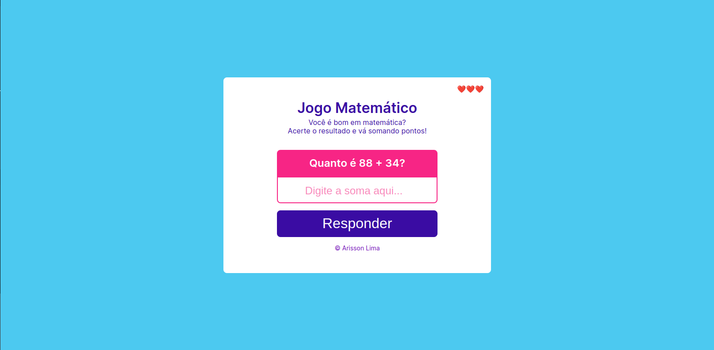

  

## 💻 Projeto

Esse projeto nasceu com base em um exercício de lógica passado pelo Augusto Monteiro no seu curso de Lógica de Programação. Como forma de me aprimorar, resolvi criar uma interface gráfica para este simples jogo.

## ✨ Tecnologia

- [HTML](https://developer.mozilla.org/pt-BR/docs/Web/HTML)
- [CSS](https://developer.mozilla.org/pt-BR/docs/Web/CSS)
- [JavaScript](https://developer.mozilla.org/pt-BR/docs/Web/JavaScript)
- [Git](https://git-scm.com)
- [Github](https://github.com/)

## 🎓 Autor do curso

- [Augusto Monteiro](https://www.linkedin.com/in/augustnmonteiro/)

## 📝 Licença

Esse projeto está sob a licença MIT.

---

  Feito com 💜 by Arisson Lima

